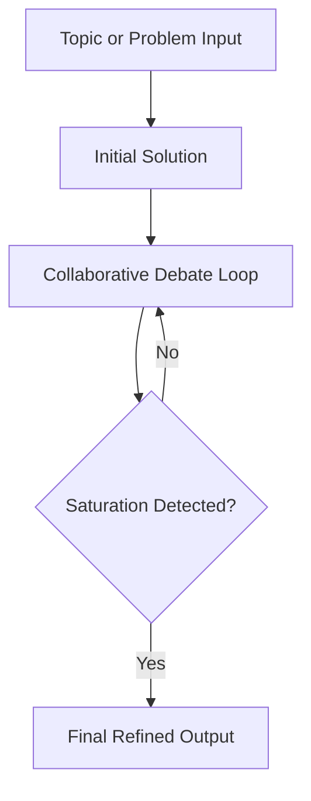

# Half-minded-scholar

This is a collaborative multi-agent reasoning system where several AI agents iteratively debate, refactor and refine a shared solution until the discussion reaches a saturation, i.e. no new critical issues or meaningful improvements are being produced.

- Instead of a fixed pipeline of roles, every agent can critique, improve, challenge or extend the evolving answer.
- The system repeatedly cycles through these interactions until the solution stabilizes.

---

## Core Concept



All agents interact with the same evolving solution and continuously reshape it through new critiques and refactoring.

---

### Debate Loop

Each iteration follows this pattern:

1. Agents read the topic and current solution  
2. Agents generate critiques and improvements  
3. Agents challenge or validate each other's reasoning  
4. The system synthesizes an updated solution  
5. The updated solution becomes the next iteration input  

This loop continues until convergence is detected.

---

### Saturation Detection

The system stops when the debate stabilizes.

Possible signals include:

```
Issue convergence  
Iteration 1 --> many issues  
Iteration 2 --> fewer issues  
Iteration 3 --> minimal issues  
Iteration 4 --> none
```

- Solution similarity  
If two consecutive solutions are highly similar, the debate is considered stable.

- Improvement plateau  
If evaluation scores stop improving significantly, the system terminates the loop.

---

## Second Phase Review

After saturation, the final solution can be reviewed by newly initialized agents that were not part of the debate. This helps detect any overlooked issues and improves reliability.

---

## Output

The system produces:

- Final refined solution  
- Debate history  
- List of critiques and improvements  
- Confidence score  
- Any remaining unresolved points

---

## Architecture

Components:
- User
- InputDebate
- Orchestrator
- Agent Pool
- Shared Solution State
- Saturation Detector
- Output Generator

The orchestrator manages iterations while agents continuously analyze and refine the shared solution state.

---

## Project Structure 
(Initial structure that I think is what we should start with)
```
half-minded-scholar/
├── README.md
├── LICENSE
├── .gitignore
├── requirements.txt
├── main.py
├── config.py
├── prompts/
│   ├── initial_solution.txt
│   ├── critique_agent.txt
│   └── synthesis.txt
├── core/
│   ├── debate_loop.py
│   ├── synthesizer.py
│   ├── saturation.py
│   └── state.py
├── agents/
│   ├── base_agent.py
│   ├── critique_agent.py
│   └── agent_factory.py
├── llm/
│   ├── llm_client.py
│   └── embeddings.py
├── utils/
│   ├── similarity.py
│   └── json_parser.py
├── experiments/
│   ├── sample_problems.txt
│   └── run_experiment.py
└── logs/
    └── debate_history.json
```

## Tech Stack
```
- Backend  
Python  
FastAPI

- Agent orchestration  
LangGraph
CrewAI

- Storage  
JSON state

- Visualization  
React
```
---

## Example
```
Topic: Design a scalable distributed cache

Iteration 1  
Agents propose Redis cluster architecture  
Critiques identify latency and failure risks

Iteration 2  
Agents introduce sharding and replication

Iteration 3  
Only minor adjustments remain

Saturation reached

Final result: refined distributed caching architecture.
```

---

### Vision

The goal is to build a general reasoning engine where multiple AI agents collaboratively critique and refine ideas until a stable, well reviewed solution emerges.

---

## Join the Journey!!!

This project started from a random idea I had, that I decided to work on even tho I’m not from the machine learning or AI domain.

The project is open to the community, and I welcome open source contributions from anyone interested in helping build and improve it.

Feel free to fork the repository, work on something that interests you and open a pull request. Suggestions, discussions and new insights & perspectives through issues are equally encouraged.


